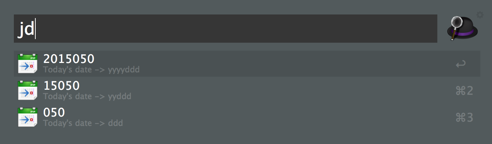

"Julian" Date utility for Alfred
=============

Dates in the mainframe world are denoted by the number of days from January 1st of a given year, often referred to as the Julian Date.  (I have Julian in quotation marks in the title because strictly speaking, the <a href="http://en.wikipedia.org/wiki/Julian_day">Julian Date</a> is the number of days since January 1, 4713 BC; the date used in the mainframe world is the ordinal date.)  

Functionality
-------

* Display today's Julian Date

* Calculate an offset of today's Julian Date

* Calculate a YYYY-MM-DD date given a Julian Date

* Calculate a Julian Date given a date in a variety of different formats

After the result has been calculated, you can send a result to the clipboard by selecting the value you want to copy.

Notes
-------

There are a lot of things that could be improved, such as dealing better with invalid entries, but it works well enough for me right now.

Credits
------------

The tool is primarily written in python, using the following additional libraries:

* [deanishe's Alfred Workflow Framework](https://github.com/deanishe/alfred-workflow) 
* [python-dateutil](https://labix.org/python-dateutil)
* icon courtesy of [Oxygen Icon Team](https://github.com/pasnox/oxygen-icons-png)